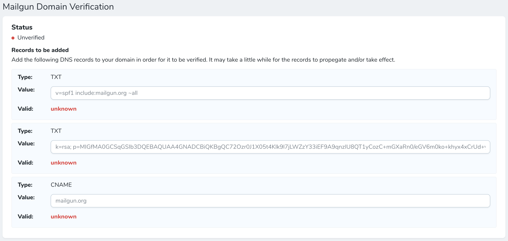
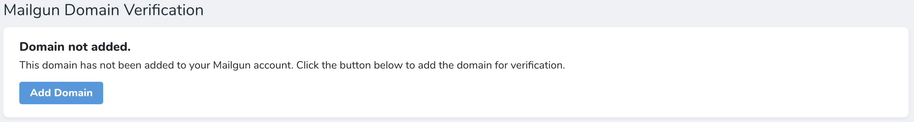

# Laravel Nova Mailgun Domain Verification

A Laravel Nova resource tool that allows users to dynamically and programatically add domains to their Mailgun account and verify their status by providing the necessary TXT and CNAME records.



## Requirements

You will need the following items to use this tool:

* A valid Mailgun account
* A private API key associated with your Mailgun account

## Installation

To install this tool, use the installation code below:

```
composer require dniccum/nova-mailgun-cerification
```

## Usage

### Environment variable

If you have haven't already, you will need to add the Mailgun API key to your `.env` file like so:

```dotenv
MAILGUN_SECRET="key-XXXXXXXXXXXXXXXXXXXX"
```

### Code

To use the tool, add the following code to your Nova resource.

```php
use Dniccum\MailgunDomainVerification\MailgunDomainVerification;

MailgunDomainVerification::make()
```

By default, the tool will look for the `email_address_domain` column in the database.

#### Options

**resourceAttribute**

If you would like to change the database column that the tool uses for domain validation, use the `resourceAttribute` option like so:

```php
MailgunDomainVerification::make()
    ->resourceAttribute('domain')
```

### Resource

After all of the appropriate credentials are in place, and no errors appear, click the "Add Domain" button to add the domain to your Mailgun account.



Once done, the tool will provide you with the necessary TXT and CNAME records for you to add to your domain.


## Credits

* [Doug Niccum](https://github.com/dniccum)

## License

The MIT License (MIT). Please see [License File](./LICENSE.md) for more information.